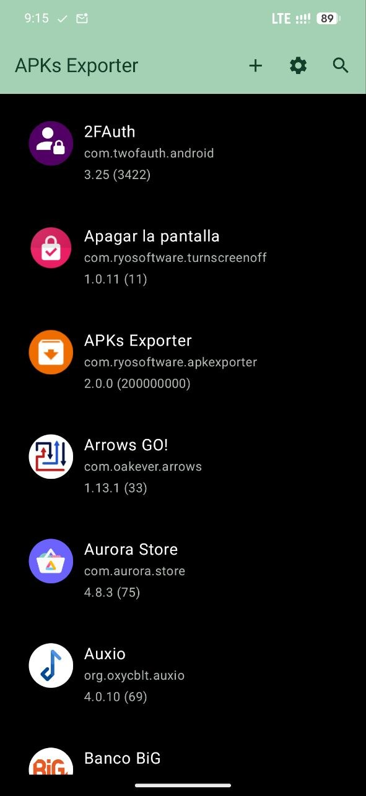
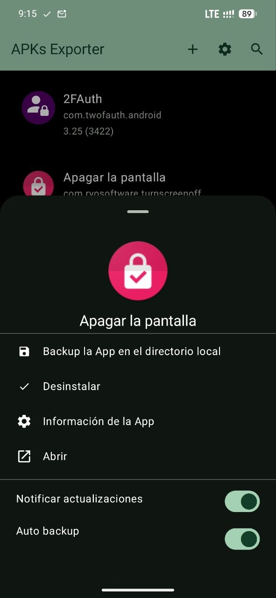
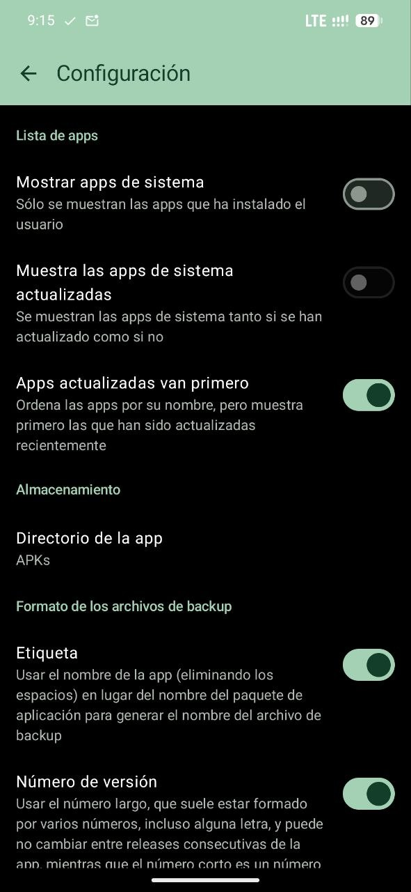

# PURPOSE

This application allows you to backup the APKs from installed apps (also supports backup apps that install from multiple APKs -splits-).

# MAIN FEATURES

- Free and open source
- Secure (no Internet permission is requested at all)
- Modern UI (build using Kotlin + JetPack compose)
- Support single and multiple apps
- Extended App info
- Automation
- Export multiple apps at once
- Install/uninstall from the app (install zip files containinig split apps allowed)

# SCREENSHOTS

  
  
  
  
  

# CERTIFICATE SIGNATURE VERIFICATION

The SHA-256 digest of the certificate used to sign the app is as follows, and remains constant regardless of the version:

`de97cd228d032a51f56407af8d69cc206e9e4d387ad30813d55da4be6ef1be3f`

The app signature  --vcertification can be checked by the following command:

`apksigner verify --verbose --print-certs app-release.apk | grep "Signer #1 certificate SHA-256 digest"`

# DISCLAIMER

THIS SOFTWARE IS PROVIDED "AS IS" AND ANY EXPRESS OR IMPLIED WARRANTIES, INCLUDING, BUT NOT LIMITED TO, THE IMPLIED WARRANTIES OF MERCHANTABILITY AND FITNESS FOR A PARTICULAR PURPOSE ARE DISCLAIMED.

IN NO EVENT SHALL WE BE LIABLE FOR ANYONE DIRECT, INDIRECT, INCIDENTAL, SPECIAL, EXEMPLARY, OR CONSEQUENTIAL DAMAGES (INCLUDING, BUT NOT LIMITED TO, PROCUREMENT OF SUBSTITUTE GOODS OR SERVICES; LOSS OF USE, DATA, OR PROFITS; OR BUSINESS INTERRUPTION) HOWEVER CAUSED AND ON ANY THEORY OF LIABILITY, WHETHER IN CONTRACT, STRICT LIABILITY, OR TORT (INCLUDING NEGLIGENCE OR OTHERWISE) ARISING IN ANY WAY OUT OF THE USE OF THIS SOFTWARE, EVEN IF NO ADVISED OF THE POSSIBILITY OF SUCH DAMAGE.

# LICENSE

This app is licensed under the terms of the <A HREF="https://creativecommons.org/licenses/by-nc-sa/4.0/deed.en">CC BY-NC-SA 4.0</A> License.

